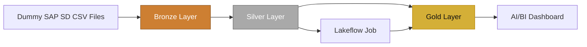
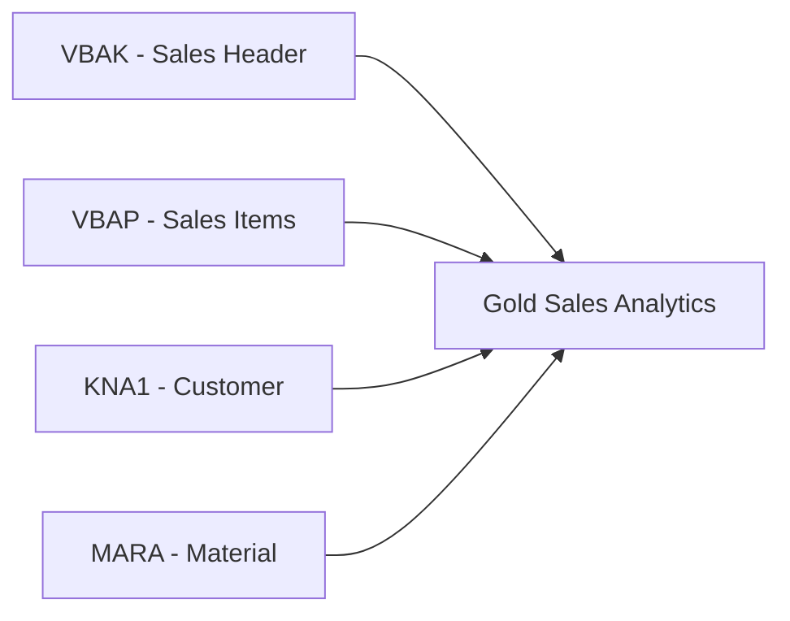
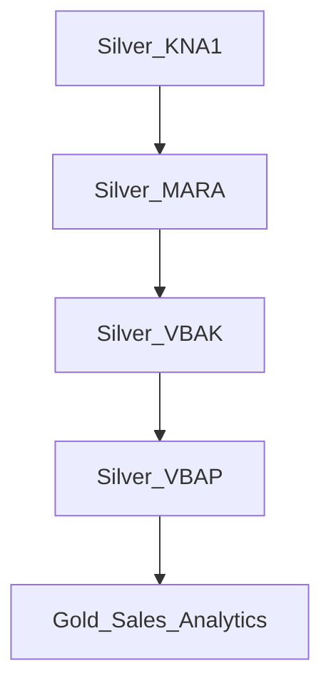

🚀 Databricks SAP SD Data Engineering Project
> End-to-end SAP SD data engineering project on **Databricks** using **dummy/mock data**, **PySpark**, **Delta Lake**, **Unity Catalog**, **Medallion Architecture**, **AI/BI Dashboard**, and **Lakeflow Jobs**.
---
📌 Project Overview
This project simulates a practical SAP SD Sales Analytics data engineering scenario using SAP-style sales data.
The objective was to build a complete pipeline from raw source files to business-ready analytics using the Bronze → Silver → Gold Medallion Architecture.
The project includes:
Raw SAP-style data ingestion
Data cleaning and standardization with PySpark
Data quality checks and validation
Delta tables in Unity Catalog
Gold-layer analytical modeling
AI/BI dashboard creation
Lakeflow Jobs orchestration
Daily scheduling and run monitoring
> **Note:** All data used in this project is dummy/mock data created for learning and portfolio purposes.
---
🧰 Tech Stack
Technology	Usage
Databricks	Main data engineering platform
PySpark	Data cleaning and transformation
Spark SQL	Data exploration and analytics
Delta Lake	Managed Bronze, Silver, and Gold tables
Unity Catalog	Catalog, schemas, and table organization
Medallion Architecture	Bronze → Silver → Gold design
AI/BI Dashboard	Sales analytics visualization
Lakeflow Jobs	Workflow orchestration and scheduling
SAP SD-style Data	Sales business scenario
---
🏗️ Architecture

Data Flow
Raw CSV → Bronze → Silver → Gold → Dashboard
The current Lakeflow workflow automates the Silver and Gold processing steps.  
Bronze ingestion was performed manually in this portfolio version.
---
📂 SAP-Style Source Data
The project uses four SAP SD-style datasets:
SAP Table	Description	Raw Rows
KNA1	Customer Master	105
MARA	Material Master	84
VBAK	Sales Order Header	612
VBAP	Sales Order Items	1,780
The source files intentionally contain data quality issues such as:
Duplicate records
Extra spaces
Inconsistent text casing
Missing values
Mixed and invalid date formats
Invalid quantities and prices
Invalid plant values
Incorrect calculated net values
Orphan material references
---
🥉 Bronze Layer
Bronze stores the raw source data with minimal transformation.
Catalog Structure
```text
sap_sd_project
│
├── bronze
│   ├── kna1_raw
│   ├── mara_raw
│   ├── vbak_raw
│   └── vbap_raw
│
├── silver
│
└── gold
```
Bronze Tables
```text
sap_sd_project.bronze.kna1_raw
sap_sd_project.bronze.mara_raw
sap_sd_project.bronze.vbak_raw
sap_sd_project.bronze.vbap_raw
```
Why Bronze?
Preserve the original source state
Keep traceability between raw and cleaned data
Separate ingestion from transformation logic
Make Silver and Gold reproducible
---
🥈 Silver Layer
The Silver layer performs data cleaning, standardization, deduplication, validation, and quality checks using PySpark.
---
👤 1. Customer Cleaning — KNA1
Notebook:
```text
01_Silver_Customer_Cleaning
```
Main transformations:
Trimmed and formatted customer names
Standardized country values
Restored SAP-style leading zeros for `KUNNR`
Filled missing City / Region values using a controlled mapping
Removed duplicates using:
```text
MANDT + KUNNR
```
Output:
```text
sap_sd_project.silver.kna1_clean
```
---
📦 2. Material Cleaning — MARA
Notebook:
```text
02_Silver_Material_Cleaning
```
Main transformations:
Trimmed `MATNR`
Standardized material types
Replaced missing material groups with `UNKNOWN`
Standardized sales/base units to `EA`
Flagged invalid negative gross weight
Flagged missing net weight
Validated:
```text
NET_WEIGHT <= GROSS_WEIGHT
```
Output:
```text
sap_sd_project.silver.mara_clean
```
---
🧾 3. Sales Order Header Cleaning — VBAK
Notebook:
```text
03_Silver_Sales_Header_Cleaning
```
Main transformations:
Standardized currency values
Standardized order status values
Standardized sales organization values
Restored leading zeros for `KUNNR`
Parsed multiple date formats into one clean order date
Flagged invalid dates
Flagged missing customer IDs
Removed duplicates using:
```text
MANDT + VBELN
```
Output:
```text
sap_sd_project.silver.vbak_clean
```
---
🛒 4. Sales Order Item Cleaning — VBAP
Notebook:
```text
04_Silver_Sales_Item_Cleaning
```
Main transformations:
Standardized material IDs
Standardized sales units
Standardized plant values
Flagged invalid quantities
Flagged invalid/null prices
Validated net value using:
```text
NETWR ≈ KWMENG × NETPR
```
Detected orphan materials using referential integrity checks
Removed duplicates using:
```text
MANDT + VBELN + POSNR
```
Output:
```text
sap_sd_project.silver.vbap_clean
```
---
✅ Data Quality Strategy
Instead of silently correcting every invalid value, the project uses explicit quality flags where appropriate.
Examples:
```text
KUNNR_MISSING_FLAG
AUDAT_INVALID_FLAG
KWMENG_INVALID_FLAG
NETPR_INVALID_FLAG
WERKS_INVALID_FLAG
NETWR_MISMATCH_FLAG
MATERIAL_INVALID_FLAG
BRGEW_INVALID_FLAG
NTGEW_MISSING_FLAG
```
This makes data quality issues visible and traceable.
---
🥇 Gold Layer
Notebook:
```text
05_Gold_Sales_Analytics
```
The Gold layer combines cleaned SAP SD entities into one analytical sales dataset.
Join Logic

Main Gold Attributes
Customer
```text
CUSTOMER_NAME
CITY
COUNTRY
REGION
```
Material
```text
MATERIAL_TYPE
MATERIAL_GROUP
BASE_UNIT
GROSS_WEIGHT
NET_WEIGHT
```
Sales
```text
VBELN
POSNR
ORDER_QTY
NET_PRICE
NET_VALUE
SALES_AMOUNT
```
Time
```text
ORDER_DATE
ORDER_YEAR
ORDER_MONTH
ORDER_QUARTER
```
Status
```text
ORDER_STATUS
ORDER_STATUS_DESC
```
Gold output:
```text
sap_sd_project.gold.sales_analytics
```
---
📊 AI/BI Dashboard
The Gold table was used to build a Databricks AI/BI Dashboard for SAP SD sales analytics.
Executive KPIs
KPI	Result
Total Sales	414M
Total Orders	600
Completed Orders	401
Total Customers	100
Dashboard Visuals
Sales by Material Group
Sales by City
Monthly Sales Trend
Dashboard Preview
> Add your dashboard screenshot to `assets/dashboard.png`.
```markdown

```
---
⚙️ Lakeflow Jobs
I created a Lakeflow Job named:
```text
SAP_SD_Medallion_Pipeline
```
The notebooks run sequentially using task dependencies.

Tasks
```text
Silver_KNA1
   ↓
Silver_MARA
   ↓
Silver_VBAK
   ↓
Silver_VBAP
   ↓
Gold_Sales_Analytics
```
Job Features Used
Notebook task dependencies
Serverless execution
Manual test runs
Daily scheduling
Run history
Task-level monitoring
Successful Run
```text
Status: Succeeded
Duration: 2m 39s
```
> Add the run screenshot to `assets/job-run.png`.
```markdown

```
---
⏰ Scheduling
The pipeline was configured with a daily schedule.
This allows the Silver and Gold processing steps to run automatically on a recurring basis.
> In this portfolio version, Bronze ingestion is manual. A future enhancement would be to automate Bronze ingestion using Auto Loader or another file-ingestion mechanism.
---
📁 Recommended Repository Structure
```text
databricks-sap-sd-data-engineering/
│
├── README.md
│
├── notebooks/
│   ├── 01_Silver_Customer_Cleaning.py
│   ├── 02_Silver_Material_Cleaning.py
│   ├── 03_Silver_Sales_Header_Cleaning.py
│   ├── 04_Silver_Sales_Item_Cleaning.py
│   └── 05_Gold_Sales_Analytics.py
│
├── data/
│   ├── KNA1_CUSTOMER_RAW.csv
│   ├── MARA_MATERIAL_RAW.csv
│   ├── VBAK_SALES_HEADER_RAW.csv
│   ├── VBAP_SALES_ITEM_RAW.csv
│   └── DATA_DICTIONARY.csv
│
├── assets/
│   ├── dashboard.png
│   ├── job-dag.png
│   └── job-run.png
│
└── docs/
    └── Omar_Oun_SAP_SD_Databricks_Portfolio.pdf
```
---
▶️ How to Run
1. Create the Catalog
```sql
CREATE CATALOG IF NOT EXISTS sap_sd_project;
```
2. Create Schemas
```sql
CREATE SCHEMA IF NOT EXISTS sap_sd_project.bronze;
CREATE SCHEMA IF NOT EXISTS sap_sd_project.silver;
CREATE SCHEMA IF NOT EXISTS sap_sd_project.gold;
```
3. Load Raw CSV Files
Load the four dummy SAP SD source files into the Bronze schema.
4. Run Silver Notebooks
Run:
```text
01_Silver_Customer_Cleaning
02_Silver_Material_Cleaning
03_Silver_Sales_Header_Cleaning
04_Silver_Sales_Item_Cleaning
```
5. Run Gold Notebook
Run:
```text
05_Gold_Sales_Analytics
```
6. Build the Dashboard
Use:
```text
sap_sd_project.gold.sales_analytics
```
as the source table.
7. Run the Lakeflow Job
Execute:
```text
SAP_SD_Medallion_Pipeline
```
and monitor the tasks from the Databricks Jobs UI.
---
🎯 Skills Demonstrated
Databricks
PySpark
Spark SQL
Delta Lake
Unity Catalog
Medallion Architecture
Data Cleaning
Data Quality Engineering
Deduplication
Referential Integrity
Data Modeling
SAP SD Data Understanding
Dashboard Development
Lakeflow Jobs
Workflow Orchestration
Scheduling
Monitoring
---
🔮 Future Improvements
Possible next steps for this project:
Automate Bronze ingestion using Auto Loader
Add incremental processing
Add Data Quality expectations
Add more SAP SD tables
Build customer and material dimensions
Add pipeline alerts
Add CI/CD with Databricks Asset Bundles
Connect real SAP data sources when available
---
👨‍💻 Author
Omar Oun
SAP & Data Engineering Portfolio Project
---
⚠️ Disclaimer
This repository uses dummy/mock SAP-style data created for educational and portfolio purposes.
It does not contain real SAP customer, company, or production data.
